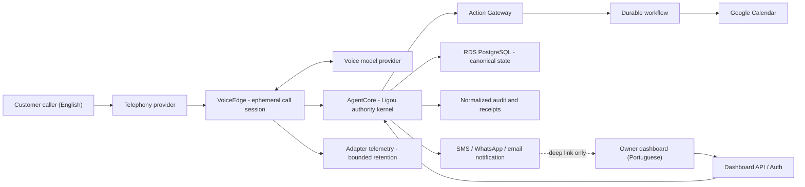
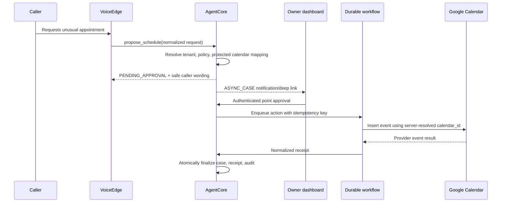
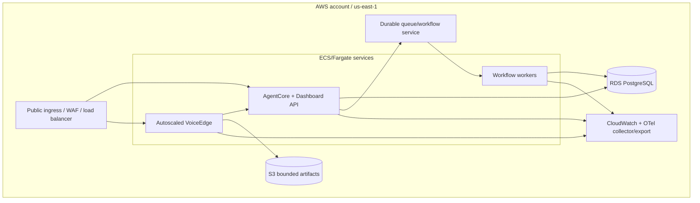

# Ligou Principal Architecture

Status: **ready for architecture review; no production implementation authorized**

Baseline: `d1fmarketing/ligou-ai@161e8e84cbc3c675869e7018f1bf2a3b11cbae99`

## Executive recommendation

Build the smallest Ligou-owned deterministic authority kernel and reuse mature components around it. The product is not the voice model, a telephony carrier, an MCP server, or an agent framework. The product is the persistent company-specific identity, memory, policy, approval, task, action, and audit system that remains correct when any one provider changes.

The first vertical slice contains exactly:

- one company, location, owner, phone number, and secondary Google Calendar;
- inbound customer calls in English;
- owner onboarding, configuration, and dashboard interaction in Portuguese;
- one out-of-policy scheduling proposal;
- one dashboard point approval;
- one durable calendar action with an idempotent receipt;
- one structured, versioned memory update;
- one complete audit trail.

It excludes outbound consumer calls, campaigns, generic sales automation, DWD, audio recording by default, and production rollout.

## Invariants

1. **One Ligou identity.** Providers and model versions may change without creating a different product identity.
2. **One persistent isolated AgentSpace per tenant.** Identity and memory persist; a process does not need to remain alive.
3. **Server-derived tenant authority.** Tenant, calendar mapping, policy scope, and approval scope never come from model arguments or caller content.
4. **Dashboard authority.** Only an authenticated dashboard action can approve or create policy in the first slice.
5. **Deterministic external actions.** Every side effect is authorized, idempotent, durable, and receipted outside the model.
6. **Provider containment.** Provider SDK types and raw events stop at adapters. Canonical state may keep only normalized audit metadata.
7. **Domain ownership.** Ligou owns operational agent state; connected systems remain sources of truth for their domains.
8. **Deny on ambiguity.** Missing tenant context, mapping, policy, approval, or freshness means no side effect.

## System context

## Logical components

### Tenant Resolver

Resolves `TenantContext` from a trusted inbound binding:

- called phone number / carrier trunk mapping for calls;
- authenticated organization membership for dashboard traffic;
- signed internal task envelope for workers.

It rejects any conflicting tenant identifier in user, model, webhook, URL, or task payload.

### VoiceEdge

An ephemeral per-call session boundary. It:

- validates carrier webhook/signature and replay window;
- binds the call to an immutable `TenantContext`;
- opens the selected voice-provider session;
- exposes only allow-listed normalized tools;
- streams customer/agent events and normalized usage metadata;
- submits structured proposals, never direct business side effects;
- terminates or hands off safely at provider/session limits.

VoiceEdge may run as short-lived or autoscaled ECS/Fargate compute. A tenant does not need an always-on task.

### AgentCore

The provider-independent authority kernel. It owns:

- cases and proposals;
- policy evaluation and versioned memory;
- approvals and escalation policy;
- durable task requests and receipts;
- canonical audit events;
- normalized conversation summaries and evidence references.

It does not store provider SDK objects, raw Google IDs in model-visible state, or media transport state.

### Dashboard API

Authenticates the owner, derives tenant membership server-side, enforces authorization, and turns an explicit user action into a point approval or policy change. Notification links open this surface; they do not carry approval authority.

### Action Gateway

The only path from agent reasoning to external mutation. It resolves protected identifiers, evaluates policy/approval, acquires idempotency, dispatches a durable workflow, validates the provider result, and commits a receipt. See [`API_AND_TOOL_CONTRACTS.md`](API_AND_TOOL_CONTRACTS.md).

### Durable workflow layer

Executes external side effects through retries, timeouts, cancellation, and compensation. DBOS and Step Functions Standard are the initial spike candidates. The architecture requires the semantics, not a predetermined engine.

### Data plane

RDS PostgreSQL is proposed for canonical relational state. Every tenant-owned row carries `tenant_id`, protected by RLS and application-level invariants. S3 is optional for bounded transcript/telemetry artifacts. pgvector is a derived index inside the same tenant boundary.

## Control flow: out-of-policy scheduling

The caller is not kept waiting for the pilot approval. Future `EscalationPolicy` modes may include `LIVE_TRANSFER`, `CALLBACK`, and `DENY`, but only `ASYNC_CASE` is in the first slice.

## Google Calendar boundary

- Tenant one uses standard user OAuth with offline access as the intended Workspace calendar owner.
- The backend creates or records the secondary calendar and stores Google’s returned identifier in an internal tenant mapping.
- The model receives a capability such as `schedule_for_tenant`, never a raw `calendar_id` or refresh token.
- The Action Gateway resolves the mapping after tenant authorization.
- DWD is not part of the pilot. If tenant one requires it, its security/blast-radius spike becomes blocking before real use.

## Deployment topology under study

For the private pilot, shared compute plus logically isolated tenant data is the proposed minimum. A physical topology tier—dedicated database, account, or task boundary—remains a candidate for customers whose compliance/risk needs justify its cost. See ADR-004.

The actual AWS account was inspected read-only: it has existing CloudFormation/ECR foundations but no ECS cluster or RDS instance in `us-east-1`. This package neither creates nor assigns existing resources to Ligou.

## Source-of-truth boundaries

| Domain | Authority |
|---|---|
| Tenant identity, AgentSpace, cases, policies, approvals, tasks, receipts, audit | Ligou |
| User login and identity proof | Selected identity provider; Ligou owns organization authorization |
| Calendar event state | Google Calendar; Ligou stores mapping, intent, receipt, and synchronized reference |
| Phone number/SIP call state | Telephony provider; Ligou stores normalized call lifecycle and binding |
| Model session/audio transport | Voice provider; Ligou stores only normalized evidence required by policy |
| Raw transcript during retention window | Restricted Ligou artifact store |
| Semantic retrieval index | Derived Ligou index, rebuildable from approved canonical memory |

## Security and privacy posture

- no default audio recording;
- proposed raw transcript retention of 30 days, pending legal decision;
- separate retention and access for raw provider telemetry;
- encryption in transit and at rest, secrets in a managed secret store;
- least-privilege OAuth scopes and AWS roles;
- fail-closed RLS plus tenant isolation tests;
- signed webhook validation and replay defense;
- caller/model content always treated as untrusted;
- explicit approval/policy state machine and tamper-evident audit;
- DWD, outbound calling, and physical isolation are separate decisions.

The full analysis is in [`THREAT_MODEL.md`](THREAT_MODEL.md).

## Quality strategy

The first implementation phase must make architecture executable through tests:

- pure unit tests for policy, scope, state machines, and normalization;
- database integration tests that attempt cross-tenant reads/writes under real runtime roles;
- contract tests for every adapter and provider-event normalization;
- workflow tests for retry, duplicate, timeout, cancellation, and stale results;
- voice evaluations for English callers, Portuguese owner names/data, interruptions, corrections, noisy audio, tool latency, and truthful failure language;
- load tests based on measured busy-hour arrival distributions;
- restore, export, deletion, and credential-revocation drills.

## Review map

- Decisions: [`DECISION_REGISTER.md`](DECISION_REGISTER.md) and [`adrs/`](adrs/)
- Evidence and reuse: [`EVIDENCE_REGISTER.md`](EVIDENCE_REGISTER.md), [`REUSE_LANDSCAPE.md`](REUSE_LANDSCAPE.md)
- Domain and contracts: [`DATA_MODEL.md`](DATA_MODEL.md), [`API_AND_TOOL_CONTRACTS.md`](API_AND_TOOL_CONTRACTS.md)
- Voice and memory: [`VOICE_ARCHITECTURE.md`](VOICE_ARCHITECTURE.md), [`MEMORY_ARCHITECTURE.md`](MEMORY_ARCHITECTURE.md)
- Security and economics: [`THREAT_MODEL.md`](THREAT_MODEL.md), [`COST_AND_CAPACITY.md`](COST_AND_CAPACITY.md)
- Work before implementation: [`SPIKE_PLAN.md`](SPIKE_PLAN.md), [`OPEN_QUESTIONS.md`](OPEN_QUESTIONS.md)
- Gated delivery sequence: [`IMPLEMENTATION_PLAN.md`](IMPLEMENTATION_PLAN.md)
- Optional future review roles: [`PROPOSED_AGENTS.md`](PROPOSED_AGENTS.md)

## Hard stop

This package is an architecture recommendation, not authorization to install dependencies, write production services, create AWS resources, use customer credentials, alter DNS/telephony, push a branch, or open a pull request.
