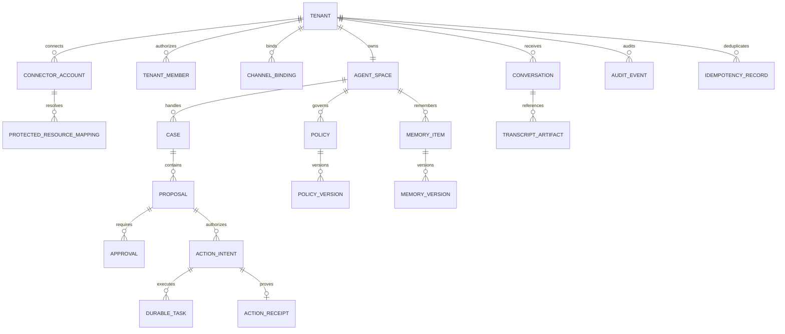

# Canonical Data Model

Status: **Proposed**. Names express domain boundaries; physical schema and ORM remain implementation decisions.

## Design rules

1. Every tenant-owned record has an immutable `tenant_id` set from trusted server context.
2. Globally unique IDs are opaque UUIDv7/ULID-style values; ordering never grants authority.
3. External provider IDs live in protected mapping/reference tables and never become model-selected capabilities.
4. Mutable business concepts are versioned; audit and receipts are append-only.
5. State transitions use optimistic concurrency (`version`) and database transactions.
6. Idempotency is a first-class record, not a best-effort cache.
7. Timestamps are UTC instants plus explicit business timezone where calendar interpretation requires it.
8. Provider-specific payloads do not enter canonical tables.

## Entity map



## Identity and tenancy

### `tenant`

| Field | Purpose |
|---|---|
| `id` | Immutable tenant key. |
| `slug` | Human-facing label; never an authorization token. |
| `status` | `ONBOARDING`, `ACTIVE`, `SUSPENDED`, `DELETING`, `DELETED`. |
| `default_timezone` | IANA timezone for business interpretation. |
| `data_region` | Approved storage/processing region. |
| `created_at`, `updated_at`, `version` | Lifecycle/concurrency. |

### `agent_space`

Exactly one canonical AgentSpace per tenant in the initial product.

| Field | Purpose |
|---|---|
| `id`, `tenant_id` | Persistent product identity. |
| `display_name` | Tenant-specific presentation of Ligou. |
| `primary_language`, `caller_languages` | Owner/dashboard and caller language policy. |
| `status` | `DRAFT`, `ACTIVE`, `PAUSED`, `ARCHIVED`. |
| `policy_set_version` | Snapshot pointer used for deterministic evaluation. |
| `memory_revision` | Monotonic memory revision for retrieval provenance. |

### `tenant_member`

Maps an external identity-provider subject to tenant role(s): `OWNER`, `ADMIN`, `OPERATOR`, `AUDITOR`. Membership is resolved server-side after authentication. No caller or model can create membership.

### `channel_binding`

Maps a trusted inbound channel identifier to one tenant:

- `PHONE_NUMBER` / provider number or trunk;
- future channel identifiers only through reviewed binding types.

The protected provider identifier is encrypted/tokenized as appropriate. Bindings cannot overlap while active.

## Connectors and protected resources

### `connector_account`

Stores normalized metadata for a tenant-owned external authorization:

- `provider` (`GOOGLE_CALENDAR` initially);
- encrypted credential reference, never credential material in ordinary rows;
- scopes, authenticated subject, owner email hash/display where approved;
- token status, expiry metadata, last refresh/error;
- created/revoked timestamps.

### `protected_resource_mapping`

Maps a Ligou capability to an external resource after tenant authorization.

For Google Calendar:

```text
tenant_id + capability_key="PRIMARY_SCHEDULING_CALENDAR"
  -> connector_account_id
  -> encrypted external calendar_id
  -> owner_subject + mapping_version
```

The model sees the capability key at most. It never provides, selects, or receives the external `calendar_id`.

## Conversations and cases

### `conversation`

Normalized call/session record:

- tenant/channel binding and external call reference;
- started/ended timestamps and finish reason;
- selected voice provider/model/pinned version;
- normalized provider request/session IDs;
- usage totals and latency aggregates;
- consent/recording flags (recording defaults false);
- links to transcript artifacts, cases, and audit.

Raw provider events remain in adapter-scoped telemetry, not this row.

### `transcript_artifact`

Metadata pointer to restricted object storage:

- object reference, content hash, encryption key reference;
- language/source classification;
- retention class and `delete_after`;
- redaction status and access classification.

The proposed raw-transcript retention is 30 days, pending legal approval.

### `case`

An operational situation requiring tracking beyond a model turn.

States:

```text
OPEN -> WAITING_APPROVAL -> APPROVED -> EXECUTING -> RESOLVED
  |           |                |           |
  +---------> DENIED <---------+---------> FAILED
  +---------> EXPIRED
  +---------> CANCELLED
```

Transitions are explicit; not all arrows are valid. `resolution_reason`, `closed_at`, and actor provenance are required at terminal states.

### `proposal`

A normalized, non-authoritative suggestion generated from a conversation or owner input:

- `type` (`SCHEDULE_APPOINTMENT` initially);
- validated business fields;
- evidence references and model metadata;
- evaluated policy snapshot/version;
- risk and reason codes;
- `expires_at` and `version`.

A proposal alone cannot trigger an external mutation.

## Policy, approval, and memory

### `approval`

Point approval of one exact proposal version:

- approver tenant member and authenticated session evidence;
- proposal content hash/version;
- scope `THIS_ACTION_ONLY` for the first slice;
- decision `APPROVE`, `DENY`, `EXPIRE`, `REVOKE`;
- decision timestamp, reason, and idempotency key.

Any material proposal change invalidates the approval.

### `policy` and `policy_version`

A reusable rule is distinct from point approval. Creating or changing one requires stronger, explicit dashboard confirmation.

Policy versions include:

- normalized conditions and effect (`ALLOW`, `REQUIRE_APPROVAL`, `DENY`);
- scope (service/location/time/value/category);
- effective and expiry times;
- creator, confirmation evidence, superseded/revoked relation;
- immutable canonical JSON hash.

### `memory_item` and `memory_version`

Memory is typed rather than an undifferentiated transcript:

- `BUSINESS_FACT`, `OWNER_PREFERENCE`, `CUSTOMER_CONTEXT`, `PROCEDURE`, `POLICY_REFERENCE`;
- provenance and confidence;
- sensitivity and retention class;
- effective/expiry timestamps;
- status `PROPOSED`, `ACTIVE`, `SUPERSEDED`, `REVOKED`, `EXPIRED`;
- conflict relation and version chain.

Policy authority always wins over ordinary remembered preference.

## Actions, durability, and receipts

### `action_intent`

The exact authorized side effect:

- action type and canonical normalized input;
- tenant/policy/approval snapshot;
- protected resource capability and resolved mapping version;
- canonical payload hash;
- state `AUTHORIZED`, `QUEUED`, `RUNNING`, `SUCCEEDED`, `FAILED`, `CANCELLED`, `UNKNOWN`.

### `durable_task`

Engine-neutral workflow record:

- task type, state, attempt, not-before/deadline;
- workflow/run identifiers;
- input/output hashes and last error classification;
- cancellation/freshness token;
- lock/lease metadata if the selected engine needs it.

### `idempotency_record`

Unique on `(tenant_id, operation, idempotency_key)`. Stores request hash, status, result/receipt reference, and expiry. Reusing a key with a different request hash fails closed.

### `action_receipt`

Append-only normalized proof:

- action intent and idempotency record;
- provider and protected resource mapping version;
- normalized external resource reference;
- request/result hashes;
- started/completed timestamps and outcome;
- provider request ID, latency, usage, finish reason where relevant;
- reconciliation status.

“The model said it completed” is never a receipt.

## Audit

### `audit_event`

Append-only, tenant-bound event envelope:

```text
event_id, tenant_id, occurred_at, actor_type, actor_id
action, object_type, object_id, outcome, reason_code
trace_id, source_ip/device metadata where appropriate
previous_hash, event_hash, schema_version
```

Payloads contain normalized diffs/references and are classified for PII. High-value events include a hash chain or immutable export to detect tampering.

## Database enforcement

- Enable RLS and `FORCE ROW LEVEL SECURITY` on every tenant table.
- Runtime roles neither own tables nor have `BYPASSRLS`/superuser.
- Set tenant context transaction-locally from authenticated server state.
- Policies require `tenant_id = current_setting(...)` for both `USING` and `WITH CHECK`.
- Unique and foreign-key constraints include tenant scope where needed to prevent cross-tenant references.
- Background/system jobs use explicit narrowly scoped roles; no universal “service bypass” in ordinary paths.
- Migration owner is separate from runtime roles and unavailable to application containers.

## Retention and deletion classes

| Class | Proposed treatment |
|---|---|
| Audio | Not recorded by default. |
| Raw transcript | 30 days, then verified deletion; pending legal approval. |
| Raw adapter telemetry | Short, separately controlled debugging retention. |
| Structured conversation summary | Provisional; legal/product decision required. |
| Cases, approvals, policy versions, receipts | Business/audit retention; duration unresolved. |
| Ordinary memory | Tenant-controlled lifecycle and retention by type. |
| Audit/security evidence | Longer tamper-evident retention; duration unresolved. |
| Derived embeddings | Delete/rebuild whenever source is revoked, expired, or deleted. |

The deletion workflow must cover canonical rows, derived indexes, object versions, caches, analytics exports, and backup-expiry policy.
