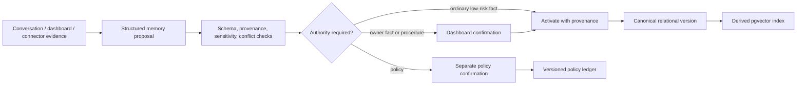

# Memory Architecture

Status: **Proposed**.

## What “persistent Ligou” means

Persistence belongs to the AgentSpace’s identity, cases, policy, memory, tasks, receipts, and audit—not to an always-running model process. A fresh VoiceEdge session reconstructs the minimum approved context from canonical state.

## Memory classes

| Class | Example | Authority | Default behavior |
|---|---|---|---|
| Business fact | service area, business hours | Owner/connector provenance | Versioned, may require owner confirmation |
| Owner preference | preferred appointment padding | Owner | Versioned, bounded scope/expiry encouraged |
| Customer context | pronunciation, access note | Caller/owner with provenance | Sensitive, purpose-limited, retention-controlled |
| Procedure | intake steps | Owner/admin | Versioned and reviewable |
| Policy | after-hours jobs under threshold | Explicit owner policy confirmation | Evaluated deterministically; never inferred from frequency |
| Episodic summary | outcome of a prior case | System from receipted events | Structured and linked to evidence |
| Raw transcript | call text | Restricted evidence artifact | Proposed 30-day retention, not canonical memory |
| Embedding | vector representation | Derived | Disposable and rebuildable |

## Write path



The model proposes memory; it does not silently rewrite authoritative policy.

## Retrieval path

1. derive tenant and purpose from trusted context;
2. select allowed memory classes for that purpose;
3. apply active/version/effective/expiry/sensitivity filters in SQL;
4. optionally run tenant-filtered semantic retrieval over derived embeddings;
5. re-fetch canonical records by tenant-bound IDs;
6. rank with authority and recency, not vector similarity alone;
7. return bounded context with memory IDs, versions, and provenance;
8. record which versions influenced a decision.

No cross-tenant global vector search is allowed. A vector hit is never itself authorization.

## Conflict and precedence

```text
explicit current policy
  > explicit current owner fact/procedure
  > verified connector fact
  > receipted historical outcome
  > caller-provided current-call assertion
  > inferred/low-confidence memory
```

Conflicts create a reviewable state. The system does not merge contradictory facts into an invented compromise.

## Correction, revocation, and forgetting

- Edits append a new version and supersede the old version.
- Revocation makes a version ineligible for future retrieval without erasing required audit.
- Expiry is enforced at query time and by cleanup workflow.
- Derived embeddings/caches are deleted or rebuilt when source state changes.
- Customer deletion/export follows a typed provenance graph rather than transcript keyword search.
- Backups age out according to documented retention; immediate physical deletion from every backup is not falsely promised.

## Memory safety

- Treat transcript and imported text as untrusted data, including prompt-injection strings.
- Never store executable instructions, code, tool schemas, or credentials as ordinary memory.
- Escape/label retrieved content as evidence, not system instruction.
- Limit memory payload size and normalize sensitive fields.
- Apply tenant RLS and purpose-based application authorization.
- Keep policy evaluation in deterministic code over normalized versions.
- Record retrieval IDs/versions for audit and reproduction.

## Quality evaluation

The memory spike must test:

- retrieval of the right tenant and version;
- exclusion of revoked/expired/conflicting memory;
- policy precedence over preference;
- provenance and sensitivity filtering;
- deletion propagation into embeddings/caches;
- prompt injection embedded in transcript/memory;
- recall/precision on Ligou scenarios;
- behavior when no adequate evidence exists.

“Remembers more” is not the goal. The goal is to retrieve the smallest correct, authorized context for the current decision.
