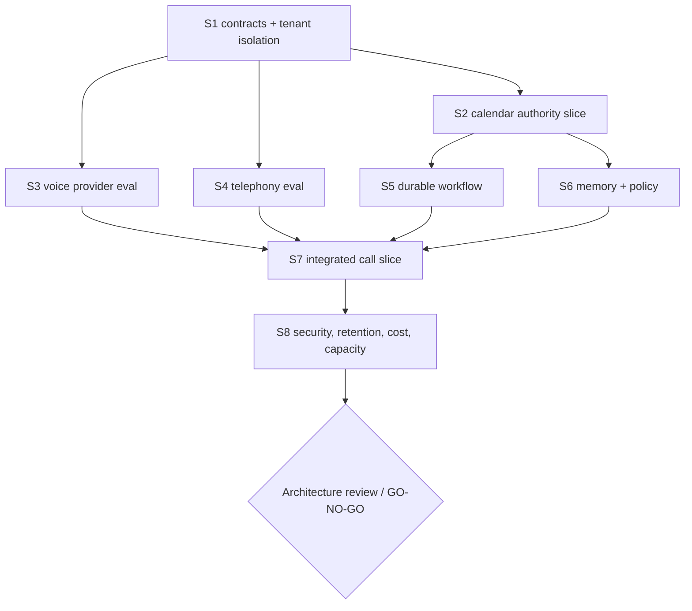

# Architecture Spike Plan

Status: **proposed evidence work only**. A spike produces disposable fixtures, measurements, and ADR evidence; it does not quietly become production.

## Rules for every spike

- Work in an isolated branch/environment with synthetic data and sandbox accounts.
- Pin provider/model/library revisions and record date, region, account tier, and limits.
- Define pass/fail before execution.
- Store normalized results and reproduction instructions; keep secrets/raw sensitive payloads out of Git.
- Test failure paths and adversarial cases, not only a happy demo.
- Update the Evidence Register and relevant ADR; do not promote status verbally.
- Destroy or document disposable resources after the experiment.

## Sequence and gates



## S1 — Contracts and tenant-isolation harness

**Question:** Can the thin AgentCore contract bind tenant identity and exclude provider types before choosing vendors?

Build only disposable schemas/test harnesses for:

- trusted `TenantContext` and conflicting payload tenant IDs;
- Model/Voice/Telephony/Calendar adapter normalization;
- two fake provider adapters with deliberately different event shapes;
- PostgreSQL tenant tables, RLS, `FORCE RLS`, non-owner runtime roles;
- pooled connection switching and tenant-scoped foreign keys.

**Pass:** provider events cannot serialize into canonical state; every cross-tenant read/write/reference attack fails; no missing-context path gains access.

**Fail:** any ordinary runtime role can bypass isolation, or domain contracts require a provider SDK object.

**Produces:** contract fixtures, isolation test report, ADR-003/004/006/007 evidence.

## S2 — Google Calendar ownership and Action Gateway

**Question:** Can tenant one authorize and mutate only its intended secondary calendar using standard user OAuth?

Use a sandbox Workspace/user:

- standard user OAuth with offline access as intended calendar owner;
- create/identify secondary calendar and record returned ID in protected mapping;
- verify subject, owner, scopes, refresh, expiry, revocation;
- execute one event through capability resolution, never a model-supplied ID;
- inject wrong tenant/mapping/version and revoked token;
- fault before commit, after commit/before response, and during reconciliation;
- point approval bound to exact proposal hash/version.

**Pass:** wrong resource/tenant/version never mutates; duplicate/retry yields one business effect and one canonical receipt; unknown outcome reconciles safely.

**Fail:** raw IDs/credentials cross to model context, or timeout can duplicate an event.

**Produces:** sequence evidence, receipt examples, OAuth runbook, ADR-009 promotion evidence.

If standard user OAuth cannot satisfy tenant one and DWD is proposed, stop and run a separate blocking threat/blast-radius spike before any real tenant.

## S3 — Voice provider evaluation

**Question:** Which current voice path performs Ligou’s actual operational work safely?

Test `gpt-realtime-2.1` first and at least one feasible comparator through the same VoiceAdapter. Use synthetic calls and identical fixtures covering:

- English home-service conversations with varied accents/noise/8 kHz path;
- Portuguese proper names/addresses and exact alphanumeric capture;
- interruption, self-correction, silence, backchannel, and overlapping speech;
- fast read, slow proposal, rejected, stale, timeout, unknown, and pending approval tools;
- prompt injection and requests for other customer/company data;
- disconnect/session-limit behavior;
- actual provider usage and latency events.

Metrics: exact task/tool success, critical-field accuracy, unauthorized-action rate, false-confirmation rate, p50/p95 first audio/turn/tool/task latency, completion/transfer/drop rate, and all-in variable cost.

**Hard pass:** zero unauthorized action/cross-tenant leak/false confirmed receipt in the acceptance set; thresholds for quality/latency/cost are approved before running.

**Produces:** versioned eval dataset/results and ADR-005 evidence.

GPT-Live-1 is not part of this spike until an eligible public API contract exists.

## S4 — Telephony provider comparison

**Question:** Which carrier provides the safest portable inbound path?

Run the same small test through Twilio and Telnyx where feasible:

- acquire/use sandbox number and inbound SIP/media route;
- signature validation, timestamp and event replay;
- called-number tenant binding and caller-ID spoof assumptions;
- DTMF, hangup, disconnect/reconnect, transfer readiness;
- concurrent calls/CPS behavior and account-limit confirmation;
- usage record/invoice reconciliation;
- number ownership, port-out, support, and incident process.

**Pass:** security, call quality, operational, portability, and budget gates pass.

**Produces:** carrier scorecard with evidence, ADR-011 update.

**Rule:** starting per-minute price is not the deciding score.

## S5 — Durable workflow bake-off

**Question:** Can DBOS or Step Functions provide the required semantics with the smaller total operating body?

Implement the disposable calendar workflow in both:

- queue, wait/retry/backoff, timeout, cancel/freshness, deploy/version behavior;
- crash before/after external commit;
- unknown-outcome reconciliation;
- idempotency under duplicate signals/events;
- execution/audit visibility and tenant/trace correlation;
- local/CI test ergonomics, AWS resources, estimated cost, exit/export path.

**Pass:** one candidate meets all failure semantics and operator needs.

**Escalate:** compare Hatchet only if neither is adequate; Temporal only for documented unmet complexity.

**Produces:** decision matrix and ADR-010 promotion/rejection evidence.

## S6 — Memory and policy safety

**Question:** Can Ligou remember useful facts while preventing silent policy mutation and cross-tenant retrieval?

Test typed/versioned memory and a derived pgvector index for:

- provenance, authority, scope, expiry, conflicts, supersession, revocation;
- exact policy precedence over preferences and semantic matches;
- poisoned transcript/memory prompt injection;
- tenant and purpose filtering before/after vector retrieval;
- deletion/export propagation into index/cache/artifacts;
- retrieval precision/recall on approved scenarios.

**Pass:** revoked/expired/wrong-tenant memory is never returned; policy changes require explicit confirmation; source deletion removes derived eligibility.

**Produces:** memory eval and ADR-008 evidence.

## S7 — Integrated vertical slice

**Question:** Do the surviving components form one coherent, recoverable call-to-receipt path?

One synthetic tenant, owner, number, calendar, conversation, out-of-policy case, dashboard approval, durable action, receipt, memory update, and audit trail. Include failure injection and restart every process between stages.

**Pass:** canonical state alone reconstructs the case; exactly one authorized external action occurs; every customer-visible status matches the receipt; no raw provider type/ID/secret appears in AgentCore state.

**Produces:** architecture conformance report and trace/audit example.

## S8 — Security, privacy, cost, and capacity gate

Run:

- threat-model validation and web/API/voice red-team cases;
- credential/secret/image/dependency scanning;
- retention, access, export, deletion, backup/restore drills;
- per-tenant/global rate, concurrency, and spend overload;
- measured cost reconciliation across carrier/model/AWS/observability;
- incident/kill-switch/revocation/tabletop exercises.

**Pass:** all pre-production blockers in [`THREAT_MODEL.md`](THREAT_MODEL.md) close, economics meet the approved floor, and residual risks have owners/review dates.

**Produces:** GO/NO-GO dossier. A GO permits a separately approved pilot deployment plan; it is not created by this document.

## Required result template

```text
Spike ID / date / owner
Question and predetermined thresholds
Pinned code/provider/model/region/account tier
Fixtures and reproduction steps
Results with raw measurement references
Hard-gate pass/fail
Security/privacy/cost observations
Decision impact and ADR diff
Cleanup performed
Unknowns remaining
```
