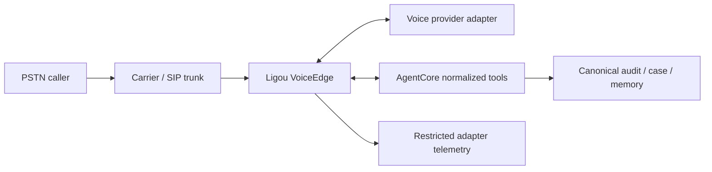

# Voice Architecture

Status: provider selection **Experimental**. OpenAI Realtime is the first strategic candidate, not an implicit winner.

## Required call path



VoiceEdge owns call/session binding and safety. A provider owns media/model inference. AgentCore owns business authority. No provider is allowed to collapse those boundaries.

## First-slice behavior

- inbound English customer calls;
- English conversation with accurate capture of names, addresses, dates, phone numbers, and Portuguese/Latino names common to the market;
- owner-facing onboarding/configuration/dashboard in Portuguese, outside the customer call;
- interruption, self-correction, silence, noise, and slow-tool behavior;
- scheduling proposal and truthful pending/confirmed language;
- no outbound campaigns and no default audio recording.

## Provider-independent session contract

VoiceAdapter emits normalized events:

```text
SESSION_STARTED
CALLER_SPEECH_STARTED / CALLER_SPEECH_ENDED
CALLER_TRANSCRIPT_PROVISIONAL / CALLER_TRANSCRIPT_FINAL
AGENT_RESPONSE_STARTED / AGENT_RESPONSE_INTERRUPTED / AGENT_RESPONSE_DONE
TOOL_REQUESTED / TOOL_RESULT_ACCEPTED / TOOL_RESULT_DISCARDED
USAGE_REPORTED
SESSION_ENDING / SESSION_ENDED / SESSION_ERROR
```

It accepts normalized controls:

```text
START_SESSION, UPDATE_INSTRUCTIONS, SUBMIT_TOOL_RESULT,
CANCEL_RESPONSE, TRANSFER_CALL, END_SESSION
```

Provider frames, event classes, and enums do not cross this interface.

## Candidate comparison

| Candidate | Evidence-backed strength | Known constraint | Ligou test required |
|---|---|---|---|
| OpenAI `gpt-realtime-2.1` | Public S2S model, SIP path, sideband server controls, function tools, configurable reasoning | 60-minute session limit; Structured Outputs are not a transaction guarantee; capacity allocation must be verified | English task success, interruptions/corrections, calendar tool latency, truthful outcomes, cost, capacity |
| GPT-Live-1 | Strategic full-duplex horizon and explicitly distinct product direction | No accepted stable public API contract in this evidence set | Blocked until contract, pricing, capacity, data terms, and eval access exist |
| xAI Speech-to-Speech | Direct inbound SIP, tools/MCP, long session, explicit PT-BR support | Default public concurrency is small; region constraint; tool reliability must be measured | Same fixture suite plus capacity escalation and portability |
| Gemini 3.1 Flash Live Preview | Multilingual live audio and function calling | Preview; synchronous tool calls; no async tool calling | Slow-tool conversational behavior and production terms |
| Amazon Nova 2 Sonic | AWS-native, PT-BR voice options, asynchronous tools | Eight-minute connection lifecycle; stale results not auto-cancelled; media bridge required | Renewal continuity, stale-result defense, SIP bridge latency |
| Cascaded STT + text model + TTS | Replaceable stages, explicit transcript and reasoning control | More components/latency; interruption orchestration is Ligou-owned | Exact tool success versus S2S, latency, naturalness, support burden |
| Deepgram Flux advisory STT | Cheap turn-aware parallel evidence | STT only; base Portuguese fallback; disagreement is not confidence | Critical field accuracy and whether advisory path changes error rate |

## GPT-Live readiness without pretending compatibility

Ligou prepares for GPT-Live by stabilizing its own contracts, not by guessing GPT-Live’s API:

- isolate media/model sessions behind `VoiceAdapter`;
- keep tools in AgentCore and Action Gateway;
- persist normalized evidence and usage;
- build provider-neutral eval fixtures;
- make session state reconstructable from canonical case/conversation state;
- avoid Realtime SDK objects in domain state.

When GPT-Live has a selectable API, it must implement the same contract and pass the same gates. No “Realtime-compatible” assumption is required.

## Tool latency and conversational continuity

Tools fall into classes:

- **fast read**: target p95 under 300 ms; conversation may use a brief neutral preamble;
- **bounded proposal**: target p95 under 800 ms; VoiceEdge can acknowledge processing without claiming outcome;
- **durable side effect**: never awaited as an unbounded live tool; returns queued/pending/confirmed normalized state;
- **approval**: pilot is asynchronous; the caller is not held for dashboard action.

If a provider blocks speech while a tool is pending, the spike measures the customer impact rather than relying on documentation adjectives such as “live” or “async.”

## Correction and stale-result protocol

1. Every model tool call gets a Ligou request ID and conversation revision.
2. Caller correction increments the relevant revision and cancels/invalidates earlier proposals.
3. Tool results include the request ID and input revision.
4. VoiceEdge discards late results whose revision is no longer current.
5. Action Gateway independently checks freshness before any mutation.
6. A stale provider result is audited, never converted into success.

## Telephony boundary

Twilio and Telnyx remain candidates. The adapter must normalize:

- inbound call validation and call ID;
- media/SIP session setup;
- hangup and transfer capability;
- DTMF where enabled;
- carrier error and final disposition;
- price/usage evidence.

The called number maps to tenant server-side. Caller ID never establishes tenant or owner authority.

## Voice evaluation gates

An identical replay/live fixture set must measure:

1. exact tool sequence and arguments;
2. names, addresses, phone numbers, dates, amounts, and spelling;
3. interruption and self-correction recovery;
4. no-action behavior on ambiguity;
5. truthful distinction among proposed, pending, confirmed, failed, and unknown;
6. latency: first audio, turn completion, tool round trip, total task;
7. noisy 8 kHz telephony and packet impairment;
8. English callers with diverse accents and mixed Portuguese proper nouns;
9. session limit/renewal and provider disconnect;
10. cost from actual usage events and carrier records;
11. transcript/data retention controls;
12. capacity and rate-limit behavior.

Hard failures include cross-tenant leakage, unauthorized action, raw protected ID exposure, false completion, unguarded duplicate action, or inability to export normalized state.

## Initial operational fallback

If the voice provider or tools become unavailable:

- preserve the call/case correlation and collected consented contact data;
- say the action is not confirmed;
- create an async case only when policy permits;
- offer a callback/contact path configured by the tenant;
- end or transfer safely according to the enabled escalation policy;
- never switch providers mid-action without idempotency/reconciliation continuity.
