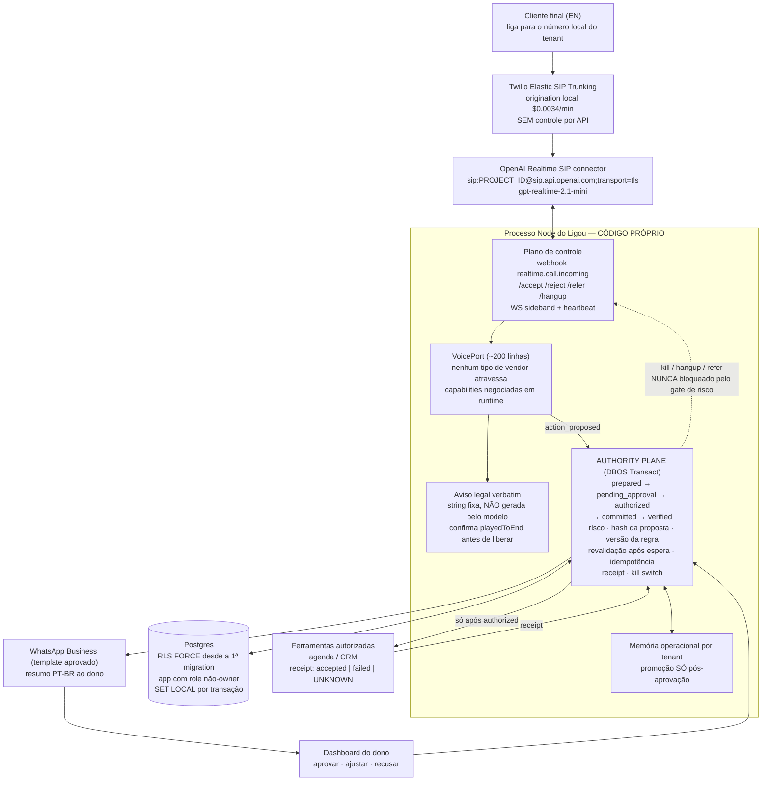

# DECISÃO DE CONSTRUÇÃO — LIGOU
**Para:** RJ (Board Chair) · **De:** Isa, arquiteta-chefe · **Data:** 17/08/2026
**Base:** inventário técnico do Ligou + pesquisa externa, ambos já passados por refutação adversarial.

> **SUPERSEDIDO:** este documento foi refeito do zero, com o produto no centro
> (funcionário de IA, não atendimento telefônico) e a decisão no topo. O vigente é
> [`DECISAO-FINAL-O-FUNCIONARIO-2026-08-17.md`](DECISAO-FINAL-O-FUNCIONARIO-2026-08-17.md).
> Este arquivo permanece como histórico das conclusões técnicas e refutações. O
> inventário bruto que sustentou a análise permanece no dossiê privado.

---

## 1. O que nós JÁ temos

**O "core de voz 80% pronto" não existia no Ligou auditado.** A busca por conteúdo
e a história Git encontraram landing, design system e protótipo de dashboard, mas
nenhuma rota de telefonia, servidor de voz, migration ou cliente de modelo. A
topologia e os locais examinados ficam registrados somente no dossiê privado.

A origem do número "80%" foi um registro conversacional privado em que a avaliação
dependia da hipótese de a infraestrutura já estar pronta. A inspeção técnica não
corroborou essa hipótese. A própria documentação do produto já registrava
"Telefonia real: Não comprovada neste repositório" e "Memória operacional: backend
não comprovado" em `docs/source/LIGOU-PRODUCT-BRIEF-WORKING.md`. Metadados da
evidência original permanecem apenas no dossiê privado.

Isso não é uma crítica. É o número que vai dimensionar prazo e dinheiro, e ele precisa ser real.

### Produto funcionando (reaproveitar)

| Componente | Onde vive | Maturidade | Reaproveitar |
|---|---|---|---|
| Landing v9 (React 19, build determinístico) | `origin/main = 161e8e8` — ponta canônica, idêntica a `codex/frontend-test-coverage` | **Produção** — 29 testes em 4 suítes, todos passam sem instalar nada | **Sim** |
| `verify-claude-v9.mjs` (136 linhas) | `scripts/` do repositório auditado | **Produção** — 3 hashes de fonte, 50 hashes fixados, 39 refs de asset, asserts de copy comercial. Rodei: passa | **Sim** — é lint de contrato de produto, não só de código |
| Pipeline de build (Bun.Transpiler, 37 linhas, zero deps) | `scripts/build-claude-v9.mjs` | **Produção** | **Sim** |
| Design system `_ds` empacotado (1.518 linhas) | `_ds/ligou-design-system-a33905fc.../` | **Produção** — React local, sem CDN | **Sim** |
| Snapshot histórico de publicação (Sites + Workers) | registro restrito de publicação | **Funcional na auditoria** — `public/v9/index.html` batia byte a byte com o `main` | **Sim**, como evidência histórica |
| Corpus de docs (3.363 linhas, 20 arquivos) | `docs/` | **Produção** — o ativo mais denso do projeto; nunca promove intenção a entrega | **Sim** |
| Mídia da hero (5 MP4 responsivos + posters, 22 MB) | `assets/` | **Produção** | **Sim** — mas 22 MB é peso real em 4G, nunca medido |

### Protótipo (não confundir com plataforma)

| Componente | Onde vive | Maturidade | Reaproveitar |
|---|---|---|---|
| Dashboard do cliente (5.565 linhas, React 19 + Vite) | branch `codex/ligou-dashboard` | **Protótipo** — 16 testes passam, mas persistência é `localStorage` e o "agente" é regex | **Parcial** |
| `model.js` (516 linhas): aprovação "só este caso" vs "virar regra", versionamento, receipt de revogação | `src/data/model.js` da branch do dashboard | **Protótipo** | **Sim, como contrato de vocabulário** — é a melhor especificação escrita do passo 7 |
| `gateway.js` (257 linhas) | branch do dashboard | **Protótipo** — zero `fetch`. O próprio código confessa: *"não há telefonia, integrações ou backend conectados"* | **Parcial** — a assinatura da API é boa fronteira; a implementação é descartável |
| `SITE_CONFIG` com `demoPhoneHref` (contrato de demo configurável) | snapshot ancestral, apagado no v9 | **Morto**, mas recuperável por `git show` | **Sim** — é o único design de ativação de voz já escrito, e o v9 o perdeu |

### Padrões técnicos previamente validados

| Componente | Proveniência | O que resolve do Ligou | Reaproveitar |
|---|---|---|---|
| Ledger de aprovação e risco | registro técnico restrito | `risk_level` validado, idempotência, hashes de decisão/revisão, receipts imutáveis e quarentena auditável | **Sim**, como padrão a reimplementar no Ligou |
| Aprovação de uso único | registro técnico restrito | Aprovação com expiração e revalidação após espera | **Sim**, como invariante |
| Ledger de memória e autorização | registro técnico restrito | propose/accept/reject, digest idempotente, receipts e autorização deny-by-default | **Sim**, como padrão a reimplementar |
| Entrega tri-estado | registro técnico restrito | `accepted` só com decisão positiva e ID concreto; `failed` só com rejeição explícita; `unknown` nunca reenvia | **Sim**, como contrato de resultado |

### Serviços necessários

O inventário de contas, credenciais e estado comercial fica no dossiê privado. Para
esta decisão basta o fato verificável no código: não havia endpoint de voz
implementado no repositório auditado.

**Correção de premissa que muda toda a conta:** o preço no ar não é $499. O artefato publicado (`src/runtime/ligou-app9.jsx`, linhas 467–488, travado por **duas suítes de teste em dois repositórios**) diz: **$299/mês para quem contratar até 31/12/2026, ativação ISENTA, valor travado enquanto a assinatura estiver ativa**; 400 min/mês, excedente $0.35/min. Os $499 + $499 são só o preço pós-oferta, num cartão secundário. A linhagem ancestral usa outra formulação ("$299 para os 25 primeiros"), mas ela é ancestral git superada pelo main — **o contrato é o que está no ar. Não há nada para reconciliar.**

---

## 2. O que nós NÃO temos — ordenado por bloqueio de lançamento

**Bloqueio absoluto (sem isto, o telefone não toca):**

1. **Runtime de voz.** Nada. Nem cliente, nem sessão, nem áudio.
2. **Plano de controle da chamada.** Webhook `realtime.call.incoming`, `/accept`, `/reject`, `/refer`, `/hangup`, WebSocket sideband. Zero linhas.
3. **Número US local por cliente.** O Ligou ainda precisava de numeração dedicada por tenant; presença local vende melhor em serviços residenciais e evita compartilhar fronteiras de compliance.
4. **Twilio Business Primary Customer Profile aprovado.** Conta nova sem PCP fica em **2 chamadas simultâneas** em Elastic SIP Trunking, somando *todos* os tenants. Dois clientes ligando ao mesmo tempo já estoura. Isso é gate de vetting, igual ao A2P.
5. **Aviso legal de gravação/transcrição.** Não é copy de landing, é requisito de engenharia: string fixa, tocada até o fim, verificada por evento, em toda chamada. CIPA §631 pega **transcrição**, não só gravação, e alcança quem "aids" — a Ligou tem exposição própria. §637.2 dá **$5.000 por violação sem exigir dano real**, e cada chamada é uma violação.

**Bloqueio de entrega (a chamada acontece mas o produto não existe):**

6. **Banco de dados.** Nenhum backend persistente ou migration do Ligou foi encontrado no repositório auditado.
7. **Isolamento multi-tenant.** Um negócio hardcoded (`business-costa-home-services`). Nenhum `tenant_id`, nenhuma RLS, nenhuma partição de memória.
8. **Máquina de estados `prepared → pending_approval → authorized → committed → verified`.** O que existe é `pendente/aprovada/recusada` em JavaScript de cliente. Faltam exatamente os três estados que representam **execução real**.
9. **Classificação de risco, hash da proposta, versão da regra, idempotência, receipt de integração, kill switch.** Todos ausentes do Ligou; a seção 1 registra apenas os invariantes técnicos reaproveitáveis.
10. **Canal de saída em português.** WhatsApp exige **Meta business verification (semanas)** + **template aprovado** — um resumo de texto livre não pode ser enviado fora da janela de 24h (erro 63016). SMS exige A2P 10DLC Standard Brand.
11. **Memória operacional por empresa** (passos 2 e 7). Não existe onde persistir.

**Bloqueio de escala:**

12. Zero CI. `verify` e as 4 suítes só rodam se alguém digitar o comando.
13. Autenticação. `/dashboard/` é estático **público**, com dados fictícios de cliente.
14. Segunda operadora / failover. Operadora única é risco existencial num produto cuja promessa é "atendemos seu telefone".
15. Health check de redirecionamento. O forward mora em hardware e operadora que não controlamos e **falha silenciosamente**: o telefone toca, ninguém atende, e não gera um único log. É o modo de falha nº 1 de ativação.
16. Evals de voz e redação de PII em PT+EN.

---

## 3. Arquitetura recomendada

### A premissa "full-duplex-first" — a refutação a derrubou, e eu sigo a refutação

O medo está certo; a prescrição está errada. A OpenAI **não publicou nada** sobre a forma da API do GPT-Live: nem transporte, nem evento, nem endpoint. A única frase oficial é *"We also plan to bring them to the API soon"* + um formulário chamado "GPT-Live-1 in the API" (verificado no ar em 17/08/2026). Escrever hoje uma interface "full-duplex-nativa" é escrever contra a **nossa imaginação de um protocolo** — trocamos um descasamento conhecido por um desconhecido.

A refutação também derrubou a "prova empírica" de portabilidade: OpenAI Realtime e Gemini Live são **ambos turn-based**, e a ABC do LiveKit é turn-shaped no osso (`generate_reply`, `commit_audio`, `truncate`). Absorver variação entre dois modelos de turno não prova que absorve uma arquitetura que elimina o turno.

**A forma correta não é turno nem duplex: é negociação de capabilities + um portão de compromisso antes da fala.**

A regra que de fato nos protege do Live não é o formato da interface. É esta: **nunca falar um compromisso antes do estado `authorized`.** Quem depende de retratar áudio já falado depende exatamente da capability que o full-duplex remove (Gemini Live já tem `message_truncation=False`). Essa regra é política, vale hoje com a Realtime, e sobrevive mesmo se a previsão sobre o Live estiver errada.

### Diagrama



### Decisão de mídia: SIP direto na Fase 1 (revertendo a pesquisa de voz)

As duas pesquisas conflitam: a de voz marcou "Twilio → OpenAI SIP direto" como **evitar** (perde o caminho de mídia); a de telefonia marcou como **adotar** (3,8× mais barato, zero infra de mídia, exemplo oficial MIT).

**Decido pelo SIP direto na Fase 1**, e explico o custo: perdemos kill switch no nível de *mídia* (cortar a fala no meio) e ficamos com kill switch no nível de *chamada* (`/hangup` pelo sideband). Isso é aceitável porque (a) a regra de commitment gate já impede o agente de falar compromisso não autorizado, que é o dano real; (b) o LiveKit cobra um lock-in escondido — os **pesos** do `turn-detector` estão sob LiveKit Model License, proprietária, que proíbe uso fora do framework LiveKit, contradizendo a própria tese de portabilidade; (c) montar media server para o cliente nº 1 é infraestrutura que não temos time para operar. O `VoicePort` mantém a porta aberta: trocar para LiveKit é uma implementação nova da interface, não uma reescrita.

**Obrigatório:** o WS sideband precisa de heartbeat e um caminho de degradação escrito — se ele cair, transferir para o celular do dono via `/refer` **antes** de perder o controle.

### A interface do adaptador de voz

```ts
// packages/voice-port — NENHUM tipo de vendor atravessa esta fronteira.
// Teto rígido: se passar de ~200 linhas de interface + shims, o desenho está errado.

/** Negociadas em RUNTIME, nunca assumidas por arquitetura. */
export type VoiceCapabilities = {
  /** Consegue retratar áudio já emitido? Realtime=true · Gemini Live=false · GPT-Live=DESCONHECIDO */
  canTruncateSpokenAudio: boolean;
  turnOwner: 'server_vad' | 'model' | 'client' | 'none_full_duplex';
  canDisableTurnDetection: boolean;
  autoRepliesAfterTool: boolean;
  supportsBargeIn: boolean;
};

export interface VoicePort {
  readonly capabilities: VoiceCapabilities;
  answer(call: InboundCall): Promise<VoiceSession>;
  reject(call: InboundCall, reason: RejectReason): Promise<void>;
}

export interface VoiceSession {
  readonly callId: string;
  readonly tenantId: TenantId;      // resolvido por registro do servidor, NUNCA por claim do modelo
  readonly ruleVersion: string;     // versão da regra carregada nesta chamada

  /** Fala DETERMINÍSTICA. Não passa pelo modelo. É como o aviso legal é tocado. */
  sayVerbatim(clip: VerbatimClip): Promise<{ playedToEnd: boolean }>;

  on(e: 'action_proposed',  h: (p: ProposedAction) => void): void;
  on(e: 'caller_confirmed', h: (c: CallerConfirmation) => void): void;
  on(e: 'transcript',       h: (t: TranscriptDelta) => void): void;
  on(e: 'closed',           h: (r: CloseReason) => void): void;

  /** Só é chamado com uma ação já committed/verified pelo authority plane. */
  deliverActionResult(r: ActionReceipt): Promise<void>;

  transferTo(target: E164): Promise<void>;      // /refer
  hangup(reason: HangupReason): Promise<void>;  // /hangup
  kill(reason: string): Promise<void>;          // kill switch
}
```

**Quatro invariantes que valem mais que o código acima:**

1. **`commitmentGate = 'pre_utterance'`.** Nenhuma frase que contenha compromisso (horário, preço, prazo) sai da boca do agente enquanto o estado não for `authorized`. O guardrail nativo de output roda sobre a transcrição de texto com `debounceTextLength` **default 100 caracteres** — ele corta *depois* que o áudio já foi falado. É rede de segurança e telemetria, **não** é o mecanismo do "Ele não inventa". O que sustenta o "Ele não inventa" é: tool-calling restrito + `tool input guardrails` (que rodam **antes** da execução da tool, e antes até do pedido de aprovação) + a máquina de estados.
2. **`intent_settled` deriva de fronteira de tool call + confirmação explícita do caller — nunca de VAD.** Assim a máquina de estados não depende da arquitetura de turno do modelo.
3. **Assimetria de segurança:** `kill`, `hangup`, `transferTo` e "escalar para o dono" **nunca** são bloqueados pelas mesmas regras que bloqueiam criar compromisso novo. Desfazer sempre passa.
4. **Receipt tri-estado:** `accepted` só com decisão positiva **e** ID concreto; `failed` só com rejeição explícita; `unknown` em todo o resto — e **`unknown` nunca reenvia**, exige reconciliação humana. É isso que impede agendar o mesmo cliente duas vezes.

### Dados

`tenant_id` em coluna + **RLS com `FORCE ROW LEVEL SECURITY` desde a primeira migration**, app conectando com role **não-owner e não-superuser**, tenant setado com `set_config(..., true)` dentro de transação explícita. Nada de schema-por-tenant. RLS é a única camada que sobrevive a um `WHERE` esquecido — e nós guardamos telefone e endereço dos **clientes dos nossos clientes**.

**Ressalva que a refutação levantou e que muda o desenho:** RLS protege o banco, **não protege o prompt**. Um resumo da empresa A entrando no contexto do modelo não é pego por nenhuma policy Postgres. Precisa de um segundo gate na montagem de contexto, com teste próprio.

---

## 4. Stack: adotar / bake-off / evitar

Só entra o que sobreviveu à refutação.

### Adotar

| Componente | URL | Licença |
|---|---|---|
| OpenAI Realtime API, `gpt-realtime-2.1-mini` (padrão) e `2.1` (escalonamento) | https://developers.openai.com/api/docs/guides/realtime | Comercial |
| Conector SIP nativo da Realtime | https://developers.openai.com/api/docs/guides/realtime-sip | Comercial |
| Twilio Elastic SIP Trunking (origination local $0.0034/min) | https://www.twilio.com/en-us/sip-trunking/pricing/us | Comercial |
| `openai/openai-agents-js` — exemplo `examples/realtime-twilio-sip` (referência de fiação) | https://github.com/openai/openai-agents-js/tree/main/examples/realtime-twilio-sip | MIT |
| `openai/openai-node` (transporte cru, pinado — escape hatch) | https://github.com/openai/openai-node | Apache-2.0 |
| DBOS Transact TS (motor durável in-process) | https://github.com/dbos-inc/dbos-transact-ts | MIT |
| `@dbos-inc/drizzle-datasource` 4.25.14 | https://www.npmjs.com/package/@dbos-inc/drizzle-datasource | MIT |
| Postgres RLS | https://www.postgresql.org/docs/current/ddl-rowsecurity.html | PostgreSQL License |
| Drizzle ORM (`pgPolicy`, `pgRole`, `.enableRLS()` — verificados no pacote) | https://orm.drizzle.team/docs/rls | Apache-2.0 |
| better-auth + plugin `organization` | https://www.better-auth.com/docs/plugins/organization | MIT |
| WhatsApp Business via Twilio (**com template aprovado**) | https://www.twilio.com/en-us/whatsapp/pricing | Comercial |
| A2P 10DLC — **UM** Standard Brand da Ligou (fallback SMS) | https://help.twilio.com/articles/1260803965530 | Pass-through TCR |
| `openai-cookbook` — `examples/evals/realtime_evals` (replay determinístico G.711 mu-law 8 kHz, confirmado em código) | https://github.com/openai/openai-cookbook/tree/main/examples/evals/realtime_evals | MIT |
| `ScriptedRealtimeTransport` (`@openai/agents-realtime/testing`, confirmado no tarball npm) | https://github.com/openai/openai-agents-js/blob/main/packages/agents-realtime/src/testing/scriptedRealtimeTransport.ts | MIT |
| Microsoft Presidio + spaCy `pt_core_news_lg` (PII PT-BR) | https://github.com/microsoft/presidio | Presidio MIT; **modelo CC BY-SA 4.0** |
| `@openai/guardrails` — Moderation, Jailbreak, Off Topic, URL Filter, PII `LOCATION` | https://github.com/openai/openai-guardrails-js | MIT |
| Langfuse self-hosted (destino de traces sob nosso controle) | https://github.com/langfuse/langfuse | MIT exceto `ee/` |
| promptfoo (red team **só com corpus sintético**) | https://github.com/promptfoo/promptfoo | MIT |

### Bake-off (decidir depois do cliente nº 1, não antes)

| Componente | URL | Licença | Quando |
|---|---|---|---|
| LiveKit Agents (assumir o caminho de mídia) | https://github.com/livekit/agents | Apache-2.0 (**pesos do `turn-detector` sob LiveKit Model License, proprietária**) | Se o modelo mudar, ou se precisarmos de AMD/IVR/fallback de modelo |
| Pipecat (`LLMTurnCompletionUserTurnStopStrategy`) | https://github.com/pipecat-ai/pipecat | BSD-2-Clause | Alternativa ao LiveKit sem o lock-in de pesos |
| Telnyx Elastic SIP (segunda operadora) | https://telnyx.com/pricing/elastic-sip | Comercial | Fase 5 — inbound $0.0032/min mas **$12/mês por canal** |
| Twilio Programmable Voice + `<Dial><Sip>` | https://www.twilio.com/en-us/voice/pricing/us | Comercial | Só se um tenant exigir gravação com consentimento por chamada |

### Evitar

| Componente | URL | Por quê |
|---|---|---|
| Twilio Media Streams como caminho primário | https://www.twilio.com/en-us/voice/pricing/us | $0.0129/min contra $0.0034 — 3,8× — e ainda construímos o relay |
| Inngest | https://github.com/inngest/inngest/blob/main/LICENSE.md | **SSPL 1.0** — licença desenhada contra quem vende SaaS |
| Temporal (self-host ou Cloud) | https://temporal.io/pricing | Certo para a escala errada: Postgres + visibility store + 4 papéis de servidor, ou $100–500/mês |
| Hatchet Cloud Team | https://hatchet.run/pricing | $500/mês = **36% do nosso preço de excedente** gasto em orquestração. Self-host = 6 containers |
| Prisma como ORM do authority plane | https://github.com/prisma/prisma-client-extensions/tree/main/row-level-security | Sem RLS nativo; o exemplo oficial diz **"not intended for production"** e quebra `$transaction` explícito |
| SignalWire | https://signalwire.com/pricing/voice | A operadora vende o próprio AI Agent Runtime a $0.16/min — é concorrente direta na mesma camada |
| Plivo, Vonage | https://www.plivo.com/voice/pricing/us/ | Plivo: minuto 62% mais caro. Vonage: preço de número não publicado sem cadastro |
| `openai/openai-realtime-agents` | https://github.com/openai/openai-realtime-agents | Parado desde 07/01/2026 — anterior ao `gpt-realtime-2.1` |
| HumanLayer, preloop, Aegis, MakerChecker, airlock, cordum | https://github.com/humanlayer/humanlayer | O líder do espaço (11,3k stars) diz no README: *"the code here is pretty much all deprecated"*, licença NOASSERTION. O resto é 2026, <1k stars, AGPL ou licença indefinida. **Nenhum modela memória por empresa, versão de regra, hash de proposta ou receipt de integração.** Essa camada é nossa, e é o fosso |
| SMS toll-free como atalho para fugir do A2P | https://help.twilio.com/articles/13264118705051 | Cai na Toll-Free Verification; não verificado = tráfego **bloqueado** desde 31/01/2024 (erro 30032) |
| Restate | https://github.com/restatedev/restate/blob/main/LICENSE | Evitar **por arquitetura** (servidor separado, contradiz o desenho in-process). **Correção:** o relatório original disse "eliminatório por licença" e isso está errado — o terceiro bullet do Additional Use Grant do BSL 1.1 cobre o Ligou quase literalmente |

---

## 5. Economia unitária

### O que é fato verificado

Taxa oficial de conversão (fonte primária, `developers.openai.com/api/docs/guides/realtime-costs`): **1 token por 100 ms de áudio do usuário, 1 token por 50 ms de áudio do assistente** — 600 tok/min ouvindo, 1.200 tok/min falando. Silêncio é filtrado por VAD e não é cobrado.

Preços por 1M de tokens (verificados dígito por dígito, duas vezes):

| | áudio in | áudio cached | áudio out |
|---|---|---|---|
| `gpt-realtime-2.1` | $32.00 | $0.40 | $64.00 |
| `gpt-realtime-2.1-mini` | $10.00 | $0.30 | $20.00 |

Twilio: origination local **$0.0034/min**, número local **$1.15/mês**. WhatsApp: **$0.005/mensagem sempre** (Twilio) + $0.0034 de taxa Meta fora da janela de 24h.

### Piso por chamada (aritmética verificável — chamada de 4 min, agente fala 1,6 min, caller fala 1,4 min)

| | áudio do agente | áudio do caller | telefonia | **piso/chamada** | **piso/min** |
|---|---|---|---|---|---|
| `mini` | $0.0384 | $0.0084 | $0.0136 | **$0.060** | **$0.015** |
| `2.1` | $0.1229 | $0.0269 | $0.0136 | **$0.163** | **$0.041** |

### Por que isso é PISO e não teto — e a má notícia

A doc oficial diz: *"The entire conversation is sent to the model for each Response... turns later in the session will be more expensive."* Numa ligação de serviço residencial com 15–25 turnos, o custo de input **cresce por turno**. O modelo linear acima é um piso teórico. **O custo real por minuto não foi medido e não pode ser derivado com honestidade daqui.**

A variável que decide a margem não é escolher `mini` vs `2.1` (fator ~3×). É **higiene de cache** (fator ~6×). Regra de arquitetura, não de otimização: prefixo estável = identidade do tenant + ferramentas + memória operacional aprovada; **tudo dinâmico entra depois do prefixo ou como resultado de tool.** Se injetarmos nome do caller ou horário atual no início do prompt, invalidamos o prefixo e o custo do flagship sai de ~$0.04/min para ~$0.25/min.

### A margem fecha?

**Contra os 400 minutos inclusos a $299/mês** (receita de $0.7475/min):

- `mini` no piso: ~$6/mês de COGS de voz → **~98% de margem bruta**
- `2.1` no piso: ~$16/mês → **~94,5%**
- `2.1` com cache quebrado (estimativa, não medida): ~$100/mês → **~67%**

**Contra o excedente de $0.35/min:** `mini` fecha com folga larga. `2.1` no piso fecha com ~88%. `2.1` com cache quebrado (~$0.25/min) cai para ~29% — sobrevive, mas é feio.

**Veredito: a margem fecha, e o custo por minuto NÃO é o gargalo deste negócio.**

**Correção 17/08 — RJ apontou, o site confirma.** A primeira versão deste documento errou aqui em dois pontos, e os dois estão retirados:

1. **O onboarding é o próprio agente — é o diferencial anunciado na landing.** O site no ar diz: *"Em uma conversa curta, ele te entrevista em português e cria a primeira versão do atendimento"* (`src/runtime/ligou-app9.jsx:430`). Ativar um cliente custa a ligação de entrevista (~30–60 min de agente em PT-BR ≈ $1–3 no piso) + número local ($1.15/mês) + chamadas de teste. **A ativação isenta custa dólares, não dias.** A consequência do erro é de engenharia, não de margem: o agente entrevistador outbound em PT-BR faz parte do MVP (Fase 2b) — sem ele, a promessa central da página é falsa.
2. **Despesas de outros projetos não entram na economia unitária do Ligou.** Custos externos ao produto ficam fora do COGS.
3. **400 min/mês são ~100 chamadas de 4 min, ou ~3,3 chamadas/dia.** Para um negócio de serviços residenciais funcionando, isso é *baixo*. O excedente provavelmente vira a norma, não a exceção — o que é **bom** se a margem de $0.35/min se confirmar, e **ruim** se o cliente sentir que o preço anunciado não é o preço real. Isso é decisão de produto, não de custo.

**Onde quebra:** não em minutos nem em onboarding. Os dois riscos reais que sobram: **(a) falha silenciosa de redirecionamento** — o telefone do cliente toca, ninguém atende, nenhum log; **(b) custo real por minuto nunca medido** (higiene de cache, fator 6×). Os dois já têm resposta no plano: health check diário (Fase 5) e as 10 chamadas medidas (Fase 2).

---

## 6. Plano em fases

### Fase 0 — Preservar o que já existe (antes de qualquer código)

- Preservar refs, checkouts e artefatos de publicação não publicados em arquivo privado.
- Verificar backups Git sem divulgar a topologia local ou o inventário de outros projetos.
- Corrigir `docs/HANDOFF-NEXT-SESSION.md` onde ele promove hipótese a verdade operacional.

**Critério de saída:** evidência privada de backup verificável e árvore do Ligou conhecida.

### Fase 1 — Abrir os gates de vetting (semana 1, em paralelo, zero código)

Três relógios que correm sem nós, e que a pesquisa original subestimou:

- **Twilio Business PCP** — sem ele, 2 chamadas simultâneas no total
- **A2P 10DLC Standard Brand da Ligou** ($46 + $15 + $10/mês) — *um só*, nunca um por cliente
- **Meta business verification + template WhatsApp aprovado** — a Twilio chama o WhatsApp de *"highly regulated channel"* e diz que a verificação *"can take several weeks"*

**Critério de saída:** PCP aprovado (concorrência ilimitada confirmada no console), brand aprovado, template de resumo aprovado pela Meta com variáveis testadas.

### Fase 2 — UMA chamada real, UM tenant (semanas 1–4)

Twilio ESIPT → OpenAI SIP → nosso processo de controle. Aviso verbatim. Memória operacional de um negócio real no prefixo do prompt. **Uma** tool (consultar agenda). Máquina de estados de 5 estados em DBOS + Postgres com RLS ligada. Resumo por WhatsApp template. `kill` funcionando.

**Fase 2b — o agente entrevistador (mesmas semanas, mesma stack):** o Ligou liga para o dono (outbound SIP), conduz a entrevista em português sobre os cinco tópicos que a própria página promete — serviços, cidades, preços autorizados, agenda, emergências — e a conversa gera a primeira versão da memória operacional, revisável no dashboard. É a mesma infraestrutura da chamada inbound com a direção invertida e outro prompt. E é também a origem da lista de risco: as respostas do dono são as categorias de ação classificadas.

**Critério de saída — todos verificáveis, nenhum opinativo:**
1. Ligação de um número real, atendida em inglês, agendamento proposto, dono aprova pelo WhatsApp, evento criado com receipt idempotente. Gravar o áudio.
2. `kill` derruba a chamada em curso em <2s, comprovado em vídeo.
3. Aprovação pendente sobrevive a `kill -9` no processo Node e é retomada com o hash revalidado.
4. **10 chamadas de duração variada com `usage` real de tokens registrado** — este é o número que substitui todos os "não verificado" da seção 5.
5. Teste automatizado provando que uma proposta de compromisso **não é falada** antes de `authorized`.
6. A memória operacional usada na chamada inbound **veio da entrevista do agente**, não de um arquivo editado à mão.

### Fase 3 — Segundo tenant, isolamento provado (semanas 5–7)

**Critério de saída:**
1. Teste pgTAP em CI provando que leitura cross-tenant retorna **zero linhas**, com o app na role não-owner.
2. Teste provando que nenhum fragmento de memória do tenant B entra no prompt montado do tenant A (gate de contexto, não RLS).
3. Lint que proíbe `set_config(..., false)` — brecha de um caractere que vaza tenant em pooler modo transaction e que **não se pega em code review humano**.
4. Kill switch por tenant **e** global, durável em banco; um bloqueio apenas in-process não sobrevive ao próximo deploy.

### Fase 4 — Evals e CI (semanas 6–9, paralelo)

Portar o `walk_harness` para `gpt-realtime-2.1` (o default do repo é `gpt-realtime`, marcado legacy). Corpus com áudio real de rua/obra, endereços e telefones americanos, a 8 kHz mu-law. `ScriptedRealtimeTransport` para o gate offline de estado (custo zero por execução).

**Critério de saída:** baseline numérico em CI de (a) acurácia de tool call, (b) captura correta de endereço e telefone, (c) zero transições ilegais de estado, (d) `verify-claude-v9.mjs` + as 4 suítes rodando em GitHub Actions.

### Fase 5 — Escala (mês 3+)

Segunda operadora (Telnyx) com runbook de failover **escrito antes do incidente**. Health check diário que liga para o número original de cada cliente e verifica se caiu no trunk — sem isso não existe SLA honesto. Autenticação no `/dashboard/`. Avaliar LiveKit se o modelo mudar.

---

## 7. O que NÃO foi verificado

**Sobre o GPT-Live (a pergunta em aberto — não resolver por conveniência):**
- A **forma** da futura API: transporte, formato de evento, endpoint, se substitui ou coexiste com a Realtime, se o conector SIP funcionará, preço, data. **Nada.** A única frase oficial é "plan to bring them to the API soon".
- **Ambiguidade não resolvida na própria página da OpenAI:** o update de 31/07/2026 diz *"audio generated with GPT-Live through ChatGPT Voice and the OpenAI API now includes SynthID watermarking... and we've introduced API access for verification"*. Minha leitura é que "API" ali se refere ao acesso de *verificação*, reforçada por três negativas independentes (ausente do pricing, ausente da lista de modelos, ausente do changelog) mais a positiva "plan to bring them to the API soon" na mesma página. **A OpenAI não desambiguou.** Não tratar como resolvido.
- A previsão de que o Live vai remover `message_truncation` é **inferência por analogia** com o Gemini Live, não fato documentado. (A mitigação derivada dela é boa política de qualquer jeito.)
- Se existe programa de acesso antecipado/enterprise. Não verificável publicamente.

**Refutado — não repetir:**
- ~~"O checkpoint do workflow DBOS commita na mesma transação Postgres do dado de negócio"~~ — o que commita junto é uma linha em `dbos.transaction_completion` no banco da aplicação; os checkpoints ficam num banco **separado** (`_dbos_sys`), e Postgres não tem transação cross-database. Ganhamos exactly-once no step transacional, **não** atomicidade da máquina de estados. Escolher DBOS pelo modelo operacional (uma lib, um processo, um Postgres, $0), que é argumento forte e verdadeiro.
- ~~"Não existe adapter Drizzle para DBOS"~~ — `@dbos-inc/drizzle-datasource@4.25.14` MIT existe; Drizzle é um dos sete datasources oficiais. Não há trade-off entre atomicidade e RLS tipado.
- ~~"WhatsApp não passa por vetting nenhum"~~ — passa, e demora semanas. A assimetria "A2P demora, WhatsApp não" **não existe**.
- ~~"WhatsApp é grátis dentro da janela de 24h"~~ — só a taxa Meta é dispensada; a Twilio cobra $0.005/mensagem sempre.
- ~~"O resumo vai por WhatsApp em texto livre"~~ — precisa de **template aprovado** (erro 63016). Isso restringe a forma do artefato central do produto e cria um ciclo de aprovação por mudança de formato.
- ~~"Unlimited Call Concurrency: Included"~~ — condicional ao Business PCP aprovado. Sem ele: **2 chamadas** (3 com Individual PCP).
- ~~"O harness de eval usa o formato de áudio antigo"~~ — já emite `{'type':'audio/pcmu'}` no shape GA. O que sobrevive é só o modelo default legacy.
- ~~"`OPENAI_AGENTS_TRACE_INCLUDE_SENSITIVE_DATA=false` resolve o vazamento de áudio"~~ — **não resolve**. Essa env var só governa `RunConfig.trace_include_sensitive_data`. Áudio é `VoicePipelineConfig.trace_include_sensitive_audio_data`, sem env var. E nada disso se aplica ao nosso caminho: no Realtime o tracing é **server-side** (`session.tracing='auto'` por default, gerado no backend da OpenAI). A mitigação correta é `tracing_disabled: true` no `RealtimeRunConfig`. **Trocar o exporter para Langfuse não desliga isso.** Este é o item mais perigoso da lista: o checklist errado faz o time marcar "resolvido" com o vazamento aberto.
- ~~"O guardrail JS não detecta endereço"~~ — `PIIEntity.LOCATION` existe, tem regex de endereço americano, não está deprecada e está no default. O que é verdade: `PERSON` é um regex de duas palavras capitalizadas (lixo, opt-in) e o `LOCATION` é anglo-cêntrico, logo **não cobre PT-BR**.
- ~~"O guardrail é só mitigação pós-fato"~~ — no canal de áudio a sessão chama `interrupt()`, e existem **tool input guardrails** que rodam antes da execução da tool. Prevenção existe pronta.
- ~~"Restate é eliminatório por licença"~~ — o Additional Use Grant cobre o Ligou quase literalmente. Evitar por arquitetura.
- ~~"A HumanLayer abandonou o espaço"~~ — pivotou; `humanlayer.com` é produto comercial vivo a $100/usuário/mês. A conclusão operacional (nada OSS mantido para adotar) sobrevive; o enquadramento, não.
- ~~"`ResponseCreateSequencer` tem ~200 linhas"~~ — tem 363. O argumento era sobre tamanho.
- ~~"Não existe ferramenta para avaliar fidelidade de resumo traduzido"~~ — existe: COMET/CometKiwi. **E ao encontrá-la aparece o bloqueio:** os checkpoints reference-free (`wmt22-cometkiwi-da`, `wmt23-cometkiwi-da-xl`) são **CC-BY-NC-SA-4.0 e gated** — proibidos num produto pago. Só `wmt22-comet-da` é Apache-2.0, e exige tradução de referência, que numa ligação ao vivo não existe. **Isso é decisão de arquitetura, não detalhe.**

**Sem fonte primária — não usar em decisão:**
- **Custo real por minuto do Ligou.** Todo número da seção 5 é piso derivado. A taxa de acerto do prompt cache — a variável que decide a margem, fator 6× — nunca foi medida.
- Custo de Postgres gerenciado ("$25–70/mês" apareceu sem nenhuma página de preço citada).
- Latência real (time-to-first-audio) de cada caminho de mídia. Pode inverter a decisão da seção 3.
- Limite de chamadas SIP simultâneas da Realtime API por tier. **Não publicado.** Somado ao gate de PCP da Twilio, é o furo de capacidade mais perigoso do plano.
- Codec que o endpoint SIP da OpenAI negocia (G.711 8 kHz narrowband vs Opus). Impacto direto em acurácia de ASR com sotaque e ruído de obra — cenário literal de roofing.
- Se a Recordings API do Programmable Voice funciona em chamadas ESIPT. Inferência forte no sentido **negativo** (a Twilio diz que chamadas ESIPT *"cannot be terminated or controlled via the API"*), mas sem declaração explícita.
- Códigos de encaminhamento condicional de T-Mobile e AT&T. Só existem em fóruns. **Não escrever o roteiro de onboarding sem testar com chip real.**
- Verizon: `*72/*71/*73`, "minuto encaminhado cobrado no plano do dono". Não confirmado em primeira mão nesta rodada, e é material — sustenta o risco de churn "dono recebe fatura inesperada".
- Se existe lei californiana de divulgação obrigatória de bot aplicável a **voz** (o B&P §17941 é escopado a interação online). **Não presumir a obrigação nem a ausência dela — perguntar a advogado da Califórnia.**
- Leis de duas partes de outros estados (FL, MA, IL, WA, PA). Não muda a arquitetura (aviso universal), muda o texto.
- `In re Otter.AI Privacy Litigation` (N.D. Cal. 5:25-cv-06911): audiência 20/05/2026, **sem decisão**, e ninguém abriu o docket. Risco vivo, jamais direito assentado.
- Comportamento do `@openai/guardrails` em PT-BR. Zero evidência. **E:** a versão npm mais recente é 0.2.1, de 15/12/2025 — ~8 meses parada.
- Estabilidade de API do `ScriptedRealtimeTransport` (existe no artefato, sem doc em prosa).
- Se o tracing/Langfuse cobre spans de sessão Realtime com a mesma fidelidade que texto.
- O que a promptfoo faz com o texto enviado para geração remota de áudio (retenção, logging, região). Página silenciosa.
- Capacidade efetiva dos hosts candidatos. "Existe host" ≠ "tem folga para áudio em tempo real".
- Se `origin/main` do Ligou reflete a mesma copy de preço da linhagem ancestral — as duas divergem.
- **Nota metodológica que vale mais que qualquer item acima:** buscas iniciais retornaram vazio para artefatos que depois foram confirmados. Um resultado vazio só vale após validar a ferramenta, o escopo e o código de saída — nunca vira afirmação por si só.

---

## 8. Decisões — tomadas com o que o site e o inventário técnico respondem

*(A primeira versão desta seção fazia 12 perguntas. RJ apontou, com razão, que a maioria já estava respondida no próprio site. Ficaram decisões, com o default aplicado — me corrija se alguma estiver errada.)*

1. **Preço:** o contrato é o que está no ar — **$299/mês para quem contratar até 31/12/2026, ativação isenta, valor travado enquanto a assinatura estiver ativa**; $499/mês + $499 de ativação só pós-oferta (`ligou-app9.jsx:471–488`). A formulação da linhagem ancestral morreu junto com a linhagem.

2. **Onboarding:** feito pelo próprio agente, como a página anuncia — *"ele te entrevista em português e cria a primeira versão do atendimento"*. Entrevistador PT-BR outbound entra no MVP (Fase 2b). Custo marginal de ativação: dólares, não dias.

3. **Lista de ações de risco:** nasce da entrevista de onboarding. Os cinco tópicos que a página promete — serviços, cidades, preços autorizados, agenda, emergências — são as categorias; template default meu, personalizado por tenant na entrevista. Não copiar classificadores de risco de outro domínio.

4. **Conta Twilio:** subconta dedicada ao Ligou desde o dia 1. Compliance e numeração não podem compartilhar fronteiras com outra operação.

5. **Canal do resumo:** WhatsApp principal, SMS A2P fallback; os dois relógios de vetting abrem na semana 1 em paralelo.

6. **Kill switch:** os dois — por tenant (botão do dono) e global (RJ) — duráveis em banco.

7. **Dashboard:** ganha login antes de qualquer link público. Hoje está público com dados fictícios.

8. **Gravação:** não grava áudio por padrão; o produto entrega o resumo, não o WAV. O aviso legal continua obrigatório de qualquer forma (transcrição já dispara CIPA).

9. **Publicação:** a landing só vai ao ar com número atendendo — regra que já era sua nos docs ("gates absolutos"). Nota de engenharia: o v9 perdeu o `SITE_CONFIG.demoPhoneHref` da linhagem anterior; religar um número real hoje exige editar JSX e rebuildar — restaurar esse contrato entra na Fase 2.

10. **Fase 0 (backups):** preservar refs, artefatos e checkouts não publicados em arquivo privado. Sobre proveniência: extrair **padrões** (máquina de estados, receipts, deny-by-default) para pacote limpo do Ligou; não importar serviços inteiros nem arrastar código de fork com upstream Apache-2.0 para dentro de produto pago.

---

**Recomendação de uma linha:** Fase 0 hoje (é backup, não construção), os três gates de vetting nesta semana, e 4 semanas para UMA chamada real ponta a ponta — inbound atendendo um cliente e outbound entrevistando o dono. O custo por minuto não é o gargalo; os riscos reais são falha silenciosa de redirecionamento e custo não medido, e os dois já têm resposta no plano. Metade do encanamento de voz vem pronto de repo MIT; o authority plane não existe em lugar nenhum do mundo, e é exatamente por isso que ele é o fosso.
