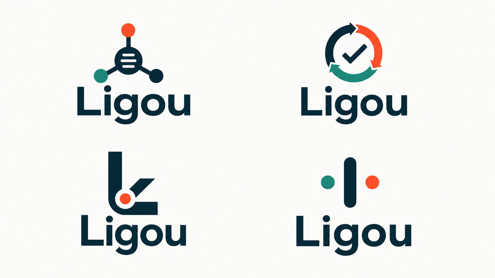
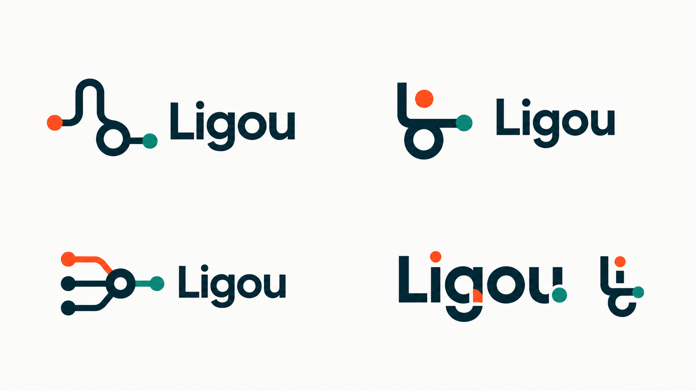

# Ligou — exploração de novo logo

**Status:** direção Claude R2 selecionada e aplicada ao candidato local; sistema final ainda não congelado

**Data:** 10 de agosto de 2026

**Ferramenta:** gerador interno de imagens, via skill `imagegen`

**Referência canônica:** `ligou-brand-board-v1-approved.png`

RJ pediu um novo logo e autorizou a geração de opções com a ferramenta interna. As
pranchas abaixo preservam o brainstorm raster que antecedeu duas rodadas de trabalho
no Claude Design. Depois dessas rodadas, RJ identificou a versão do Claude como a mais
recente e autorizou seu merge sobre a V4.

A direção atual é a marca v2 **A Linha**, entregue em SVG. Ela substitui o handset como
marca corporativa no header, footer e favicon do candidato local. Isso não congela uma
Brand Board V2 nem autoriza publicação.

## Arquivos preservados

| Rodada | Arquivo | Dimensões | Bytes | SHA-256 |
| --- | --- | ---: | ---: | --- |
| 1 | `explorations/ligou-logo-exploration-01.png` | 1672 × 941 | 954.273 | `54a199ef1dd028fe68bbbe010129cd1e505731a22edb409f01ba18e7cda3f757` |
| 2 | `explorations/ligou-logo-exploration-02.png` | 1672 × 941 | 919.223 | `6d5586c67cc43f7998b803a3841fa2ba9264873aeb4f6ebecef4bdb9c9f4567e` |

### Rodada 1

Objetivo: testar quatro territórios — agente conectado, ciclo operacional, monograma
`L` e sinal abstrato. A prancha preservou a paleta e o wordmark legível, mas os símbolos
superiores ficaram próximos de ícones genéricos de integração e workflow. O monograma
inferior esquerdo foi a direção mais promissora da rodada.

### Rodada 2

Objetivo: aumentar a propriedade da forma, usando linha contínua, monograma `L/g`,
convergência operacional e um wordmark customizado. A avaliação atual é:

- **mais forte como identidade completa:** wordmark inferior direito;
- **mais forte como símbolo isolado:** direção superior direita;
- **reserva:** monograma inferior esquerdo da primeira rodada;
- **descartar:** setas circulares, ramificações e nós que poderiam pertencer a qualquer
  SaaS de automação.

Essa avaliação foi a entrada para o refinamento no Claude, não o arquivo final.

## Resultado no Claude R2

A segunda rodada convergiu para uma única construção: uma linha de entrada, um loop
inclinado e um ponto de conclusão. O disco laranja é a versão principal; a linha
laranja sem disco é o master monocromático.

| Asset | Bytes | SHA-256 |
| --- | ---: | --- |
| `../../assets/logo-mark.svg` | 423 | `7cce8b971bd56d261ef853d3caa77c94e9ec7024d36d01c7788afe8d53d11e71` |
| `../../assets/logo-line.svg` | 368 | `7a1a424afd3f7379e46dea5e59875f5f67d766b504e55cf76361690cb92c6331` |

Fonte recebida: `/Users/d1f/Downloads/Ligou Design System.zip`, SHA-256
`3e4319ddf66eaebe1bf2ea1f6ed30e402fb584c9b48e8342d30a291492374238`.
O export misturava arquivos atuais e antigos; os hashes acima correspondem aos assets
referenciados pelo UI kit final.

## Decisão estrutural pendente

O merge estabelece uma regra provisória clara:

- **marca corporativa:** A Linha no header, footer e favicon;
- **badge de canal:** handset no peito do personagem, preservado nas imagens V4;
- **pendente:** regenerar o OG, que continua byte a byte igual ao Visual 4.

Trocar o badge do peito exigiria regenerar ou editar toda a família de imagens e ficou
fora deste merge. Essa regra precisa entrar na Brand Board V2 antes de publicação.

## Gate para aprovação

Para transformar a direção aplicada em identidade congelada, ainda faltam:

- aprovação explícita da Brand Board V2 por RJ;
- correção óptica e tipográfica final;
- versões horizontal e vertical do lockup;
- testes em fundo claro e escuro;
- leitura em 16 px;
- exportação SVG, PDF e PNG;
- atualização controlada da Brand Board V2, sem sobrescrever a board v1;
- regeneração do OG e decisão definitiva sobre o badge do personagem.

Até esse gate, A Linha é a marca ativa somente do candidato local Claude R2 e não uma
identidade pública publicada.
